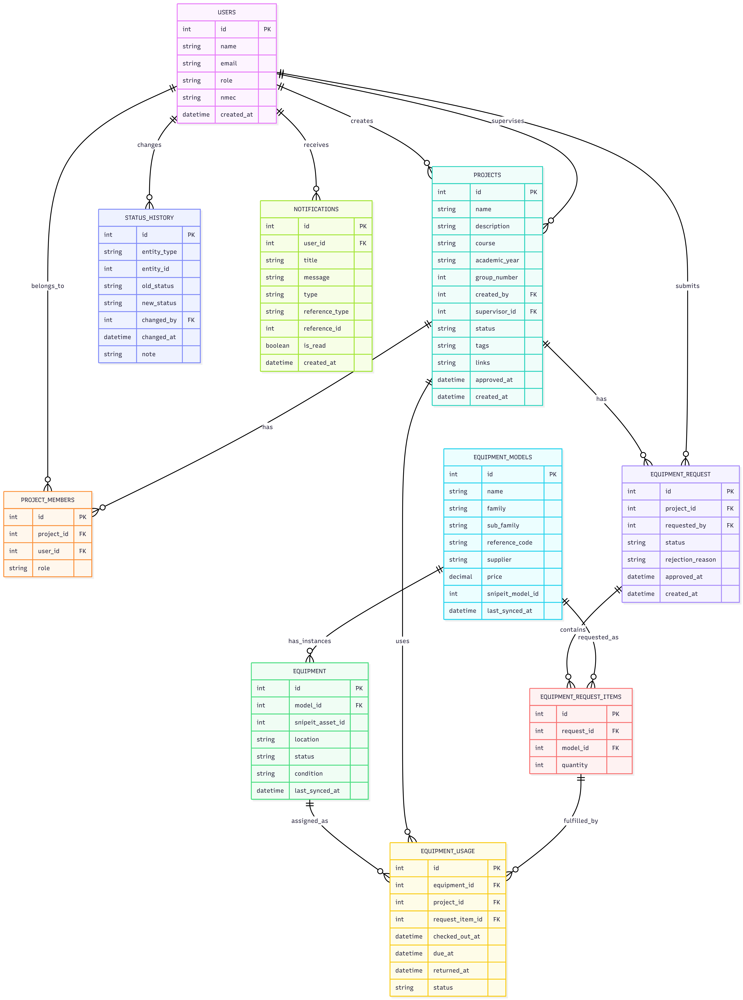

Last week, our team focused on turning the project architecture into more concrete implementation work. The main goal of this week was to strengthen the technical foundation of the system by refining the database structure, continuing frontend development, writing the technical report, and completing the virtual machine setup with the required services.

<!-- truncate -->

## Database Diagram and Data Structure

One of the main achievements of the week was preparing the **database diagram** for the new Maker Lab system. This helped us define the core entities of the platform and the relationships between them, including users, projects, project members, equipment models, equipment requests, request items, equipment usage, status history, and notifications.

Designing this structure was an important step because it made the system architecture much more concrete. It also helped us organize how project data, requisitions, and equipment assignments will be stored in a consistent and queryable way.

## Frontend Development

We also continued the **frontend work** on the platform. This stage focused on gradually turning the earlier mock-ups and requirements into actual interface elements that will support the main user workflows.

At this point, the frontend is becoming a more practical representation of the system we described in the previous milestone. This is especially important for features such as project creation, viewing project data, and handling requisition-related interactions in a clearer and more user-friendly way.

## Technical Report

Another major task this week was writing the **technical report**. The report consolidates the most important results of the project so far, including the project context, goals, selected technologies, requirements, architecture, and expected outcomes.

Preparing this document was useful not only as a formal deliverable, but also as a way to organize the project into one coherent technical vision. It helped us connect the requirements, the architectural decisions, and the implementation work already completed.

## VM, Database, and Snipe-IT Configuration

This week was also important from the infrastructure point of view. We completed the **virtual machine configuration** and finalized the setup of the main backend environment. This included preparing the **PostgreSQL database**, creating scripts for table creation, and ensuring that **Snipe-IT** is running correctly in the target environment.

This was a significant milestone because it means that the project now has a real deployment base instead of being limited to local development only. With the database and inventory system running in the VM, the integration work can move forward on top of a working environment.

## Why This Week Mattered

This week was important because it moved the project from architectural planning into a more implementation-oriented stage. The database diagram clarified the system structure, the frontend work pushed the interface further, the technical report consolidated the project vision, and the VM setup established the real technical environment for deployment and integration.

Together, these results show that the project is progressing from concept and analysis toward a working system.

## Next Steps

In the coming days, we plan to continue connecting the frontend with the backend, expand the requisition workflow implementation, and move further with the integration between the application database and Snipe-IT.

[Click here to read our technical report!](technical-report.pdf)