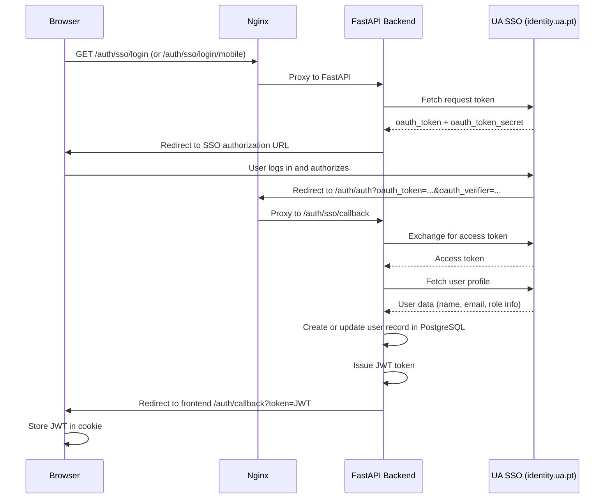

# Authentication and Authorization

## Overview

Authentication is delegated entirely to the University of Aveiro SSO. The system does not manage passwords. Authorization is enforced at two layers:

1. **Application layer** — FastAPI routes check the JWT and user role via dependency injection.
2. **Proxy layer** — Nginx enforces technician-only access to Snipe-IT using an `auth_request` subrequest.

---

## SSO flow

The system uses **OAuth 1.0** via the University of Aveiro identity provider (`identity.ua.pt`).



---

## JWT token

After successful SSO, the backend creates a JWT signed with `JWT_SECRET_KEY`.

| Claim | Value |
|---|---|
| `sub` | User's university email |
| `exp` | Expiry (configured by `JWT_EXPIRE_MINUTES`, default 60 minutes) |

**Configuration:**
```
JWT_SECRET_KEY=<strong random secret>
JWT_ALGORITHM=HS256
JWT_EXPIRE_MINUTES=60
```

:::warning
`JWT_SECRET_KEY` must be a strong, randomly generated value in production. Do not use the placeholder from `.env.example`.
:::

The token is returned as a cookie and also available as a query parameter for mobile deep-link flows.

**Cookie attributes:**
- `HttpOnly: true`
- `Secure: true`
- `SameSite: Lax`
- `Path: /`
- `max_age: 604800` (7 days, used for Snipe-IT cookie persistence)

---

## Role assignment

Roles are assigned on every login based on:

1. **`LAB_TECHNICIANS` env variable** — comma-separated list of university email addresses. If the logged-in user's email is in this list, their role is set to `lab_technician`.
2. Otherwise the role is set to `student` (or `professor` if the email pattern suggests faculty — _to verify based on SSO data available_).

Role assignment is **dynamic** — it is re-evaluated on every successful SSO login. Changes to `LAB_TECHNICIANS` take effect after the API container is restarted and the affected user logs in again.

---

## API authorization

Protected API endpoints use a FastAPI dependency (`get_current_user` in `auth/dependencies.py`):

```python
# auth/dependencies.py
def get_current_user(token: str = ...) -> User:
    payload = jwt.decode(token, settings.JWT_SECRET_KEY, algorithms=[settings.JWT_ALGORITHM])
    email = payload.get("sub")
    user = db.exec(select(User).where(User.email == email)).first()
    return user
```

Endpoints requiring technician access check `current_user.role == "lab_technician"` explicitly inside route handlers.

---

## Snipe-IT access control (Nginx `auth_request`)

Snipe-IT is not directly accessible from the internet. All requests to `/snipe-it/*` pass through Nginx, which issues an internal `auth_request` subrequest to the API:

```
GET /auth-verify  (internal, from Nginx only)
```

The verify endpoint (`auth/router.py → /auth/snipeit/verify`):

1. Reads the JWT from the cookie (or query parameter / original URI header).
2. Decodes and validates the JWT.
3. Looks up the user in PostgreSQL.
4. Returns `403 Forbidden` if the user is not `lab_technician`.
5. On success, returns `200 OK` with an `X-Remote-User: <username>` header.
6. If the token came from a query parameter, sets it as a cookie for subsequent requests.

**What happens on failure:**
- `401 Unauthorized` → Nginx redirects the browser to the SSO login flow.
- `403 Forbidden` → Nginx returns a 403 response with a human-readable message.

```
# nginx template
auth_request /auth-verify;
error_page 401 = @error401_snipeit;
error_page 403 = @error403_snipeit;

location @error401_snipeit {
    return 302 .../auth/sso/login/mobile?web_redirect=<snipeit_url>;
}
location @error403_snipeit {
    return 403 "Forbidden: Only lab technicians have access to SnipeIT.";
}
```

---

## Mobile authentication

The mobile app initiates SSO via the browser. When the SSO callback completes:

- If `mobile_<token>` flag is set: API redirects to `detimakerlab://auth?token=<JWT>` (native deep link).
- If `web_redirect` is set: API redirects to the specified URL with `?token=<JWT>` (mobile in-browser flow).

The app intercepts the deep link and stores the JWT using **Expo SecureStore**.

---

## Summary

| Layer | Mechanism | Enforces |
|---|---|---|
| Nginx `auth_request` | JWT + role check via API subrequest | Technician-only Snipe-IT access |
| FastAPI dependency injection | JWT decode + user lookup | All protected API routes |
| Role check in route handlers | `current_user.role` comparison | Technician-specific actions |
| SSO delegation | OAuth1 via UA identity.ua.pt | Credential verification |
