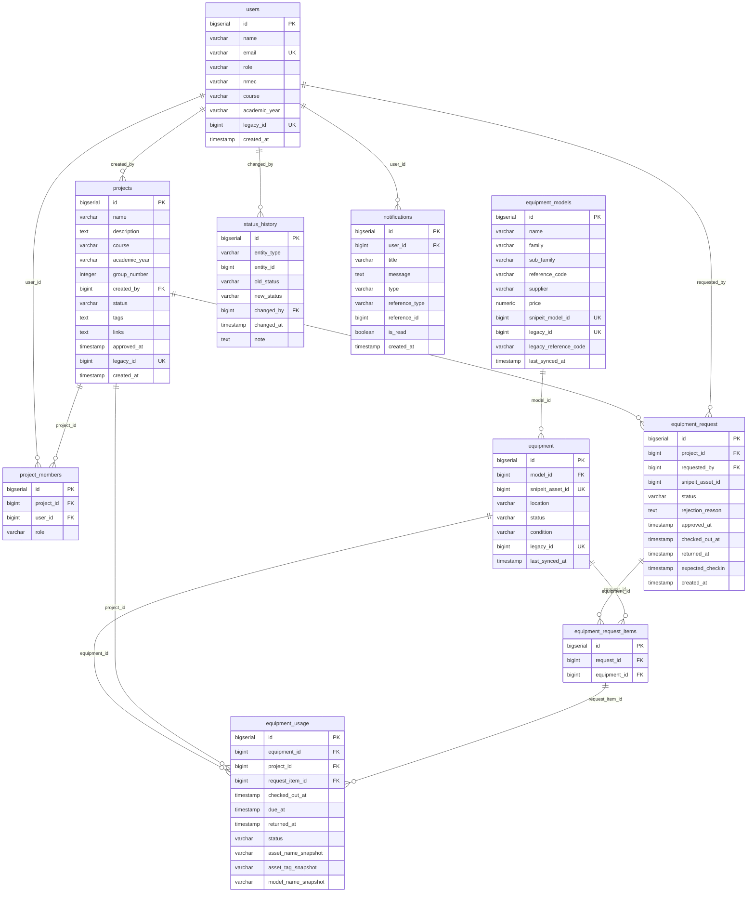

# Data Model

The MakerLab domain data is stored in a PostgreSQL 16 database. The schema is applied automatically on first container start via `infra/db/init/schema.sql`.

Snipe-IT uses a separate MariaDB database managed internally. The MakerLab application does not access the MariaDB database directly.

---

## Entity Relationship Diagram



---

## Table reference

### `users`

Stores all registered users. Created automatically on first SSO login.

| Column | Type | Notes |
|---|---|---|
| `id` | BIGSERIAL PK | |
| `name` | VARCHAR(150) | Full name from SSO |
| `email` | VARCHAR(255) UNIQUE | University email |
| `role` | VARCHAR(50) | `student`, `professor`, or `lab_technician` |
| `nmec` | VARCHAR(50) | Student number (optional) |
| `course` | VARCHAR(200) | Course name (optional) |
| `academic_year` | VARCHAR(20) | Academic year (optional) |
| `legacy_id` | BIGINT UNIQUE | Legacy wiki user ID |
| `created_at` | TIMESTAMP | |

**CHECK:** `role IN ('student', 'professor', 'lab_technician')`

---

### `projects`

A project is created by a user and can have multiple members.

| Column | Type | Notes |
|---|---|---|
| `id` | BIGSERIAL PK | |
| `name` | VARCHAR(200) | |
| `description` | TEXT | |
| `course` | VARCHAR(100) | |
| `academic_year` | VARCHAR(20) | |
| `group_number` | INTEGER | |
| `created_by` | BIGINT FK → users | |
| `status` | VARCHAR(50) | See status values |
| `tags` | TEXT | Comma-separated or JSON |
| `links` | TEXT | Related URLs |
| `approved_at` | TIMESTAMP | |
| `legacy_id` | BIGINT UNIQUE | Legacy wiki project ID |
| `created_at` | TIMESTAMP | |

**CHECK:** `status IN ('pending', 'active', 'rejected', 'completed', 'archived')`

---

### `project_members`

Junction table linking users to projects with a role.

**CHECK:** `role IN ('leader', 'member', 'observer', 'advisor', 'supervisor')`  
**UNIQUE:** `(project_id, user_id)`

---

### `equipment_models`

Represents a type or model of equipment (e.g., "Arduino Uno"). Synced from Snipe-IT models.

| Column | Notes |
|---|---|
| `snipeit_model_id` | Reference to Snipe-IT model ID |
| `legacy_id` | Legacy wiki article ID |
| `legacy_reference_code` | Original wiki Código value |

---

### `equipment`

Represents a single physical asset instance. Maps to a Snipe-IT asset.

| Column | Notes |
|---|---|
| `model_id` | FK → equipment_models |
| `snipeit_asset_id` | Reference to Snipe-IT asset ID |
| `status` | `available`, `reserved`, `checked_out`, `maintenance`, `retired` |
| `condition` | `new`, `good`, `fair`, `damaged`, `unusable` |
| `legacy_id` | Legacy wiki article ID |

---

### `equipment_request`

A requisition by a student for a specific physical asset.

| Column | Notes |
|---|---|
| `snipeit_asset_id` | Snipe-IT asset being requested |
| `status` | `pending`, `reserved`, `rejected`, `checked_out`, `returned` |
| `rejection_reason` | Set when rejected |
| `approved_at` | Timestamp of approval |
| `checked_out_at` | Detected from Snipe-IT activity |
| `returned_at` | Detected from Snipe-IT activity |
| `expected_checkin` | Optional due date |

---

### `equipment_request_items`

Links a requisition to specific equipment records. Supports multi-item requisitions.

---

### `equipment_usage`

Records actual usage of equipment: checkout time, return time, and snapshot of asset metadata at time of use.

**CHECK:** `status IN ('checked_out', 'returned', 'overdue', 'lost')`

---

### `status_history`

Immutable audit log of all status transitions for projects, equipment requests, and equipment.

**CHECK:** `entity_type IN ('project', 'equipment_request', 'equipment_usage', 'equipment')`

---

### `notifications`

User-specific notifications generated on key events (approval, rejection, checkout, return).

**CHECK:** `type IN ('info', 'warning', 'request', 'approval', 'return', 'reminder')`

---

## Schema file location

```
infra/db/init/schema.sql
```

This file is mounted as `docker-entrypoint-initdb.d/schema.sql` in the PostgreSQL container and applied automatically on first start.

To reset the schema:
```bash
docker compose -f infra/docker/docker-compose.yml down -v
docker compose -f infra/docker/docker-compose.yml up -d
```

:::warning
Running `down -v` destroys all data in the PostgreSQL volume. Only do this in development.
:::
