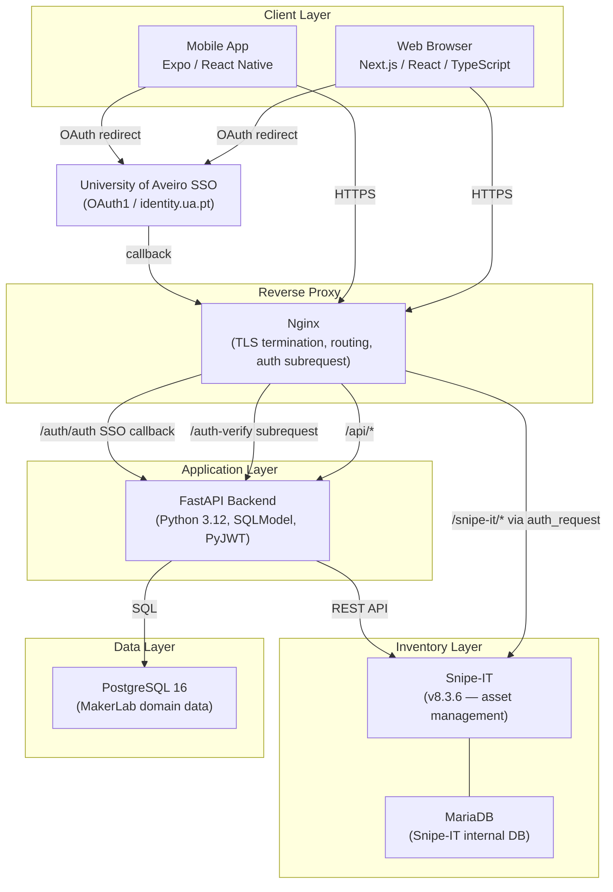

# System Architecture

The system is a multi-tier web application deployed as a Docker Compose stack behind an Nginx reverse proxy. It integrates with two external/third-party systems: the University of Aveiro SSO and Snipe-IT.

---

## Architecture diagram

---

## Component responsibilities

### Nginx (reverse proxy)

- Terminates HTTPS with self-signed or real TLS certificates.
- Routes traffic by path prefix: `/api/*` → API, `/snipe-it/*` → Snipe-IT, base path → web frontend.
- Enforces technician-only access to Snipe-IT via an `auth_request` subrequest to the API.
- Handles the SSO callback at a fixed path (`/auth/auth`) independent of any base path prefix.
- Rewrites paths before proxying so that upstream services receive clean paths.

### FastAPI backend

- Provides a REST API consumed by web and mobile clients.
- Implements the SSO authentication flow (OAuth1 via University of Aveiro).
- Issues and validates JWT tokens.
- Manages project, requisition, user, and equipment records in PostgreSQL.
- Integrates with Snipe-IT via REST API for reservations, catalog sync, and activity log polling.
- Verifies JWT and role for Nginx `auth_request` subrequests targeting Snipe-IT.

### PostgreSQL

- Stores all MakerLab domain data: users, projects, project members, equipment models, equipment, requisitions, status history, and notifications.
- Schema applied automatically on first container start via `infra/db/init/schema.sql`.
- Not shared with Snipe-IT.

### Snipe-IT

- The authoritative inventory management system for physical assets.
- All physical equipment management (checkout, check-in, asset status) is performed in Snipe-IT.
- The MakerLab API reads asset and activity data from Snipe-IT and writes reservation status changes.
- Technicians use the Snipe-IT web interface directly for day-to-day inventory operations.

### MariaDB

- Used internally by Snipe-IT only. No direct access from MakerLab application code.

### Next.js web app

- The primary user interface.
- Communicates with the backend exclusively through the configured `NEXT_PUBLIC_API_URL` path prefix.
- Handles SSO redirect and JWT cookie management.
- Supports i18n via i18next.

### Expo / React Native mobile app

- Shares the same backend API as the web app.
- Handles SSO via browser redirect and deep-link callback (`detimakerlab://auth`).
- Stores JWT securely using Expo SecureStore.

---

## Network topology

All services run in a single Docker bridge network (`backend`). Only Nginx is exposed to the internet (ports 80/443). The API is also exposed on port 8000 for local development convenience.

| Service | Internal hostname | External exposure |
|---|---|---|
| postgres | `postgres:5432` | Port 5432 (local dev only) |
| api | `api:8000` | Port 8000 (dev), via Nginx (prod) |
| web | `web:3000` | Via Nginx only |
| snipeit | `snipeit:80` | Port 8080 (dev), via Nginx (prod) |
| snipeit-db | `snipeit-db:3306` | None |
| nginx | `nginx` | Ports 80, 443 |

:::warning
In production, restrict port 8000 and 5432 from being publicly accessible. Only port 80 and 443 on Nginx should be exposed.
:::
