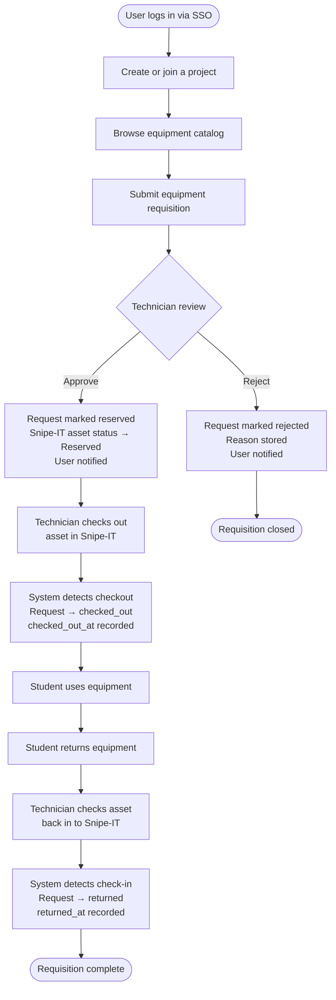

# Core Workflow

The central workflow of DETI Maker Lab is the **equipment requisition lifecycle**: from project creation through equipment request, approval, checkout, and return.

---

## Workflow overview

---

## Step-by-step description

### 1. Login
The user authenticates via the University of Aveiro SSO. On first login, their user record is created automatically. Their role (`student`, `professor`, or `lab_technician`) is set based on the configured technician email list.

### 2. Create or join a project
Users create a new project (providing name, description, course, academic year) or join an existing project as a member. Projects start in `pending` status.

### 3. Browse the equipment catalog
Users view the list of assets available in the system. The catalog is sourced from Snipe-IT and cached locally. Users can browse by model, family, availability, and location.

### 4. Submit a requisition
The user selects specific physical assets (identified by their Snipe-IT asset ID) and submits a requisition for their project. The requisition record is created in the `equipment_request` table with status `pending`.

### 5. Technician review
The technician sees all pending requests in the dashboard. They can:
- **Approve**: moves the request to `reserved`, updates the Snipe-IT asset status to `Reserved`, and sends a notification to the project.
- **Reject**: moves the request to `rejected`, stores the reason, and notifies the project.

### 6. Physical checkout (Snipe-IT)
The technician physically checks out the asset to the student in the Snipe-IT interface. This is not done through the MakerLab web app directly.

### 7. Checkout detected
The API periodically (or on-demand via `POST /api/requisitions/sync-snipeit`) reads recent Snipe-IT activity logs. When a `checkout` action is detected for an asset in `reserved` state, the local request is updated to `checked_out` and `checked_out_at` is recorded.

### 8. Return
The student returns the physical equipment to the lab. The technician checks the asset back in to Snipe-IT.

### 9. Return detected
The sync process reads Snipe-IT activity logs. When a `checkin from` action is detected for an asset in `checked_out` state, the local request is updated to `returned` and `returned_at` is recorded.

### 10. Traceability
Every status transition is recorded in the `status_history` table, including who made the change and when. Notifications are sent to project members at key transitions.

---

## Request status states

| Status | Description |
|---|---|
| `pending` | Submitted, awaiting technician review |
| `reserved` | Approved; asset reserved in Snipe-IT |
| `rejected` | Rejected by technician; reason stored |
| `checked_out` | Asset physically checked out; student has equipment |
| `returned` | Asset returned and checked back in to Snipe-IT |

---

:::tip
Multiple requisitions can be submitted during the same project lifecycle. Each requisition tracks one or more assets independently.
:::
